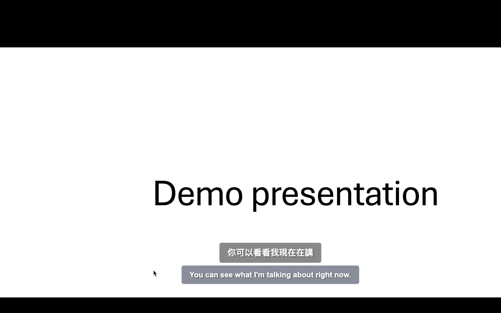
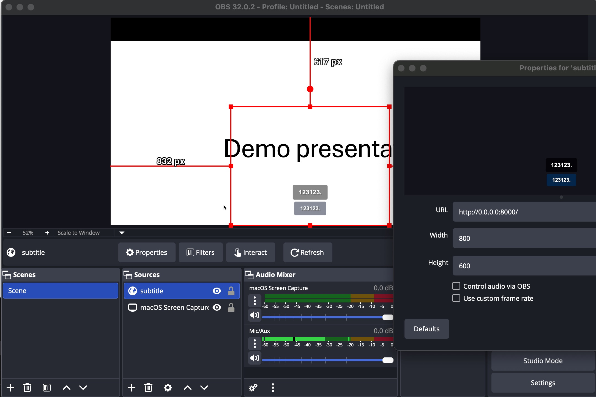
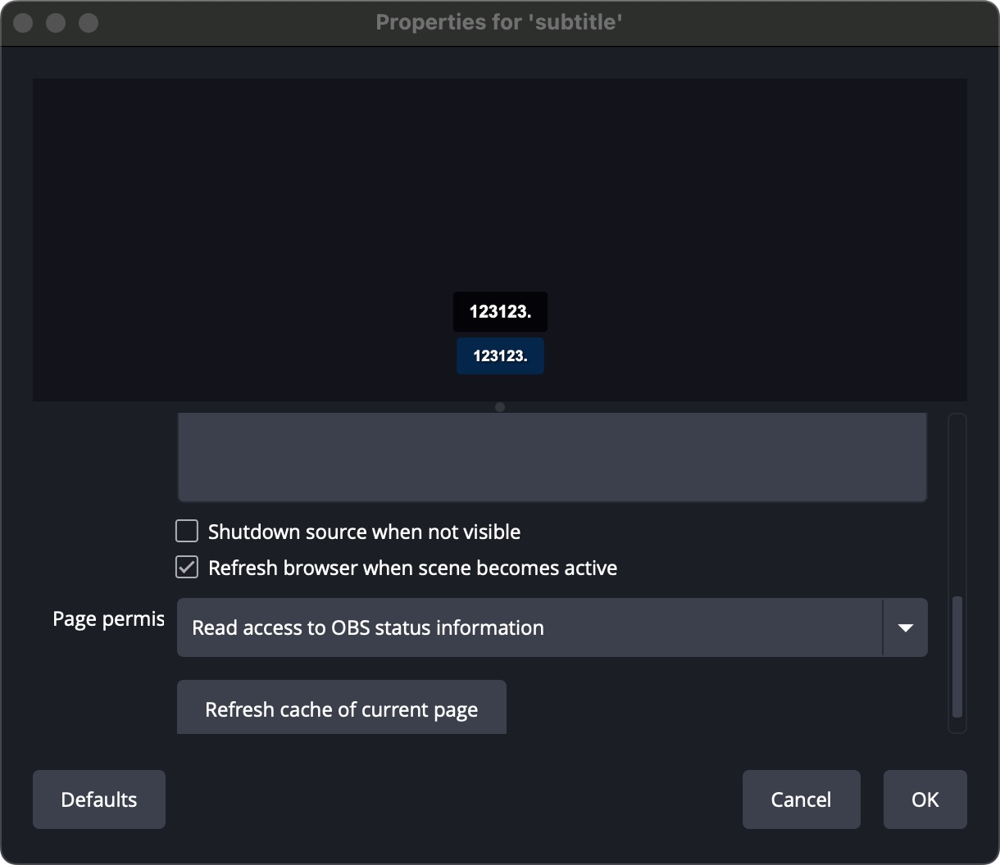

# OBS Real-Time Transcription with AWS Transcribe

Real-time speech-to-text system using AWS Transcribe with automatic language detection (English & Traditional Chinese), displaying transcribed text as subtitles in OBS.
This can be used as a real-time translation for PPT presentations. Three display screens are suggested (laptop + 2 external).



## Features

- Real-time speech transcription from microphone
- Auto language detection (English & Traditional Chinese)
- **Automatic translation**: English ↔ Traditional Chinese
- **Smart translation throttling**: Reduces API calls by 60-70% while maintaining responsiveness
- **Auto catch-up**: Clears audio backlog to prevent lag and maintain real-time display
- Dual subtitle display (original + translation)
- **Fullscreen mode**: Position original subtitle at top for PPT presentations
- Low-latency subtitle display
- OBS Browser Source integration
- Clean, customizable subtitle styling
- Translation backlog monitoring
- Performance latency tracking

## Prerequisites

- Python 3.9+
- AWS Account with Transcribe and Translate access
- OBS Studio 28.0+
- Microphone

## Installation

1. **Clone and setup**
   ```bash
   cd ./ppt-present-with-transcribe-translate-with-obs
   ```

2. **Configure AWS credentials**
   ```bash
   cp .env.example .env
   ```
   Edit `.env` and add your AWS credentials:
   ```
   AWS_ACCESS_KEY_ID=your_access_key
   AWS_SECRET_ACCESS_KEY=your_secret_key
   AWS_REGION=us-east-1
   PPT_FULL_SCREEN_MODE=false
   ```
   
   Set `PPT_FULL_SCREEN_MODE=true` to position original subtitle at top (for presentations)

3. **Install dependencies**
   ```bash
   uv venv
   uv pip install fastapi uvicorn amazon-transcribe boto3 python-dotenv sounddevice numpy websockets
   ```

## Usage

### 1. Start the Server

```bash
./start.sh
```

Or manually:
```bash
source .venv/bin/activate
cd backend
python main.py
```

The server will start on `http://localhost:8000`

### 2. Configure OBS

1. Open OBS Studio
2. Start your ppt presentation mode. 
3. Add a new **Screen Capture**
4. Add a new **Browser Source**:
   - Click **+** in Sources panel
   - Select **Browser**
   - Name it "Subtitles"
5. Configure Browser Source:
   - **URL**: `http://localhost:8000`
   - **Width**: 1920
   - **Height**: 1080
   - Check **Shutdown source when not visible**: OFF
   - Check **Refresh browser when scene becomes active**: ON


6. Position the subtitle overlay:
   - Drag to desired position (usually bottom center)
   - Resize if needed
7. Right click the merged preview screen > Open preview projector > Select display C. 

### 3. Start Speaking

- Speak into your microphone
- Two subtitle lines will appear in real-time:
  - **Top line (black)**: Original transcribed text
  - **Bottom line (blue)**: Translation
- Language auto-detection works for English and Traditional Chinese
- Translation is automatic: English → Chinese, Chinese → English

### Three-Display Setup for Presentations

Ideal setup for live presentations with real-time translation:
- **Laptop display (A)**: PowerPoint speaker view
- **Display B**: PowerPoint presentation view
- **Display C**: OBS preview output with subtitles overlay. This is the final display for your audience. It's the ppt + browser subtitle.

This allows you to:
- See your speaker notes on laptop
- Project clean slides to audience
- Broadcast slides + live subtitles via OBS

## Customization

### Performance Optimization

The system uses smart translation throttling to reduce costs and latency:
- **Final results**: Always translated immediately
- **Partial results**: Translated every 3rd update OR every 1 second (whichever comes first)

To adjust throttling, edit `backend/transcribe_client.py`:
```python
# Line ~45: Change frequency
if self.partial_count >= 3 or (current_time - self.last_translation_time) >= 1.0:
    # Increase 3 to 5 for less frequent updates
    # Decrease 1.0 to 0.5 for more frequent updates
```

Monitor translation backlog in console logs - warnings appear if queue exceeds 3 pending translations.

### Subtitle Styling

Edit `frontend/style.css` to customize:
- Font size: Change `font-size: 32px` (original) or `font-size: 28px` (translation)
- Colors: Change `color` and `background`
- Position: Change `bottom: 50px`
- Transparency: Adjust `rgba(0, 0, 0, 0.75)` or `rgba(0, 50, 100, 0.75)`

### Language Options

Edit `backend/transcribe_client.py`, line with `language_options`:
```python
language_options=['en-US', 'zh-TW', 'ja-JP', 'ko-KR']  # Add more languages
```

Supported languages: en-US, en-GB, zh-CN, zh-TW, ja-JP, ko-KR, es-ES, fr-FR, de-DE, etc.

## Troubleshooting

### No audio captured
- Check microphone permissions
- Verify microphone is selected as default input device
- Check audio levels in system settings

### AWS Transcribe errors
- Verify AWS credentials in `.env`
- Check AWS region supports Transcribe and Translate
- Ensure IAM user has `transcribe:StartStreamTranscription` and `translate:TranslateText` permissions

### Subtitles not showing in OBS
- Verify server is running (`http://localhost:8000` in browser)
- Check Browser Source URL is correct
- Try refreshing the Browser Source (right-click → Refresh)

### High latency
- Check internet connection
- Try different AWS region closer to you
- Reduce audio chunk size in `audio_capture.py`

### Translation not appearing
- Verify AWS Translate permissions in IAM
- Check browser console for errors (F12)
- Ensure both AWS Transcribe and Translate services are available in your region

## Cost Estimation

AWS costs approximately:
- **Transcribe Streaming**: $0.036 per minute (with language identification)
- **Translate**: $15 per million characters

Example: 1 hour presentation with continuous speech ≈ $2.16 (Transcribe) + ~$0.50 (Translate) = **~$2.66/hour**

## Project Structure

```
obs-transcribe/
├── backend/
│   ├── main.py              # FastAPI server with WebSocket
│   ├── audio_capture.py     # Microphone input handling
│   └── transcribe_client.py # AWS Transcribe + Translate client
├── frontend/
│   ├── subtitles.html       # Dual subtitle display
│   ├── style.css            # Styling for original + translation
│   └── script.js            # WebSocket client
├── .env                     # AWS credentials (gitignored)
├── .env.example             # Template for credentials
├── start.sh                 # Startup script
└── README.md
```

## License

MIT
